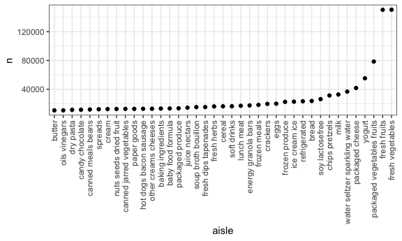

Homework 3
================
E. Brennan Bollman
20-10-09

## Problem 1

##### Step 1: Describe the instacart dataset.

``` r
data("instacart")
instacart
```

    ## # A tibble: 1,384,617 x 15
    ##    order_id product_id add_to_cart_ord… reordered user_id eval_set order_number
    ##       <int>      <int>            <int>     <int>   <int> <chr>           <int>
    ##  1        1      49302                1         1  112108 train               4
    ##  2        1      11109                2         1  112108 train               4
    ##  3        1      10246                3         0  112108 train               4
    ##  4        1      49683                4         0  112108 train               4
    ##  5        1      43633                5         1  112108 train               4
    ##  6        1      13176                6         0  112108 train               4
    ##  7        1      47209                7         0  112108 train               4
    ##  8        1      22035                8         1  112108 train               4
    ##  9       36      39612                1         0   79431 train              23
    ## 10       36      19660                2         1   79431 train              23
    ## # … with 1,384,607 more rows, and 8 more variables: order_dow <int>,
    ## #   order_hour_of_day <int>, days_since_prior_order <int>, product_name <chr>,
    ## #   aisle_id <int>, department_id <int>, aisle <chr>, department <chr>

This dataset contains 1384617 rows of individual product orders from
Instacart and 15 columns of variables such as user ID, product ID, and
day and hour of the week at which the order was placed. More detailed
information about the individual items is also available: product names,
whether the product had been ordered previously, and the departments /
aisles in which a product can be found. The dataset contains information
from 131209 unique users who ordered 39123 distinct products.

##### Step 2: Identify the most in-demand aisles.

Count the number of aisles, and identify which aisles have most items
ordered from them.

``` r
instacart %>% 
  count(aisle) %>% 
  arrange(desc(n))
```

    ## # A tibble: 134 x 2
    ##    aisle                              n
    ##    <chr>                          <int>
    ##  1 fresh vegetables              150609
    ##  2 fresh fruits                  150473
    ##  3 packaged vegetables fruits     78493
    ##  4 yogurt                         55240
    ##  5 packaged cheese                41699
    ##  6 water seltzer sparkling water  36617
    ##  7 milk                           32644
    ##  8 chips pretzels                 31269
    ##  9 soy lactosefree                26240
    ## 10 bread                          23635
    ## # … with 124 more rows

The dataset contains 134 distinct aisles. “Fresh vegetables” and “fresh
fruits” are ordered from most frequently, with nearly double the number
of item orders than the third highest in-demand aisle, “packaged
vegetables fruits”—which are then followed by “yogurt” and “packaged
cheese.”

##### Step 3: Plot aisle popularity.

Create a plot that shows the number of items ordered in each aisle,
limiting this to aisles with more than 10000 items ordered, and
arranging plot sensibly. Need to first count by aisle, then filter by
item count \>10,000. Should rotate x-axis labels so it is readable.
Finally, re-order aisle according to n, from the aisle with the lowest
number of items ordered to that with the highest ordered.

``` r
instacart %>% 
  count(aisle) %>% 
  filter(n > 10000) %>% 
  mutate(
    aisle = factor(aisle),
    aisle = fct_reorder(aisle, n)
  ) %>% 
  ggplot(aes(x = aisle, y = n)) +
  geom_point() + 
  theme(axis.text.x = element_text(angle = 270, vjust = 0.5, hjust = 1))
```



This plot demonstrates again that vegetables and fruits are much more
popular than other aisles\!

##### Step 4: Demonstrate the most popular items in select aisles.

Make a table showing the three most popular items in each of the aisles
“baking ingredients”, “dog food care”, and “packaged vegetables
fruits”. Include the number of times each item is ordered in your
table. Will filter by the above aisles, count the most popular aisles in
each. Then will rank each of the 3 aisles, for only the top 3 n’s, and
arrange them most popular to least popular for each aisle.

``` r
instacart %>% 
  filter(aisle %in% c("baking ingredients", "dog food care", "packaged vegetables fruits")) %>%
  group_by(aisle) %>% 
  count(product_name) %>% 
  mutate(rank = min_rank(desc(n))) %>% 
  filter(rank < 4) %>% 
  arrange(aisle, rank) %>% 
  knitr::kable()
```

| aisle                      | product\_name                                 |    n | rank |
| :------------------------- | :-------------------------------------------- | ---: | ---: |
| baking ingredients         | Light Brown Sugar                             |  499 |    1 |
| baking ingredients         | Pure Baking Soda                              |  387 |    2 |
| baking ingredients         | Cane Sugar                                    |  336 |    3 |
| dog food care              | Snack Sticks Chicken & Rice Recipe Dog Treats |   30 |    1 |
| dog food care              | Organix Chicken & Brown Rice Recipe           |   28 |    2 |
| dog food care              | Small Dog Biscuits                            |   26 |    3 |
| packaged vegetables fruits | Organic Baby Spinach                          | 9784 |    1 |
| packaged vegetables fruits | Organic Raspberries                           | 5546 |    2 |
| packaged vegetables fruits | Organic Blueberries                           | 4966 |    3 |

##### Step 5: Demonstrate mean hour of day for select items ordered, on each day of the week.

Make a table showing the mean hour of the day at which “Pink Lady
Apples” and “Coffee Ice Cream” are ordered on each day of the week;
format this table for human readers (i.e. produce a 2 x 7 table). First,
filter only these items. Then group by the products in question and day
of week, and summarize to find the mean hour of the day at which each
item is ordered. Finally, reformat table for easier visualization.

``` r
instacart %>% 
  filter(product_name %in% c("Pink Lady Apples", "Coffee Ice Cream")) %>% 
  group_by(product_name, order_dow) %>% 
  summarize(mean_hour = mean(order_hour_of_day)) %>% 
  pivot_wider(
    names_from = order_dow,
    values_from = mean_hour
  ) %>% 
  knitr::kable()
```

    ## `summarise()` regrouping output by 'product_name' (override with `.groups` argument)

| product\_name    |        0 |        1 |        2 |        3 |        4 |        5 |        6 |
| :--------------- | -------: | -------: | -------: | -------: | -------: | -------: | -------: |
| Coffee Ice Cream | 13.77419 | 14.31579 | 15.38095 | 15.31818 | 15.21739 | 12.26316 | 13.83333 |
| Pink Lady Apples | 13.44118 | 11.36000 | 11.70213 | 14.25000 | 11.55172 | 12.78431 | 11.93750 |

For every day of the week, coffee ice cream is ordered later in the day
than apples. Dessert is important.

## Problem 2

## Problem 3
