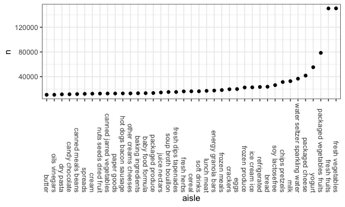
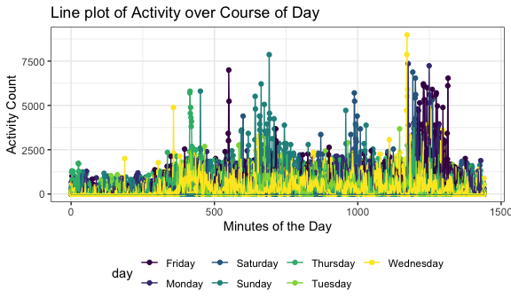
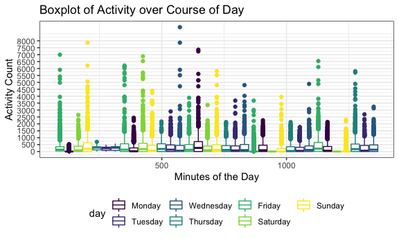
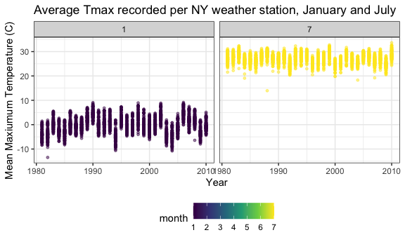
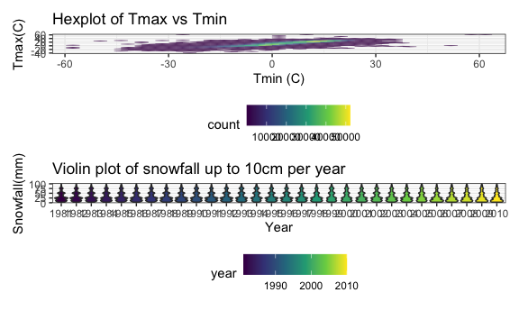

Homework 3
================
E. Brennan Bollman
20-10-10

``` r
library(tidyverse)
```

    ## ── Attaching packages ───────────────────────────────────────────────────────────────────── tidyverse 1.3.0 ──

    ## ✓ ggplot2 3.3.2     ✓ purrr   0.3.4
    ## ✓ tibble  3.0.3     ✓ dplyr   1.0.2
    ## ✓ tidyr   1.1.2     ✓ stringr 1.4.0
    ## ✓ readr   1.3.1     ✓ forcats 0.5.0

    ## ── Conflicts ──────────────────────────────────────────────────────────────────────── tidyverse_conflicts() ──
    ## x dplyr::filter() masks stats::filter()
    ## x dplyr::lag()    masks stats::lag()

``` r
devtools::install_github("p8105/p8105.datasets")
```

    ## Skipping install of 'p8105.datasets' from a github remote, the SHA1 (412759e3) has not changed since last install.
    ##   Use `force = TRUE` to force installation

``` r
library(p8105.datasets)
library(hexbin)
library(patchwork)

knitr::opts_chunk$set(
  fig.width = 6,
  fig.asp = 0.6,
  out.width = "90%"
)

theme_set(theme_bw() + theme(legend.position = "bottom")) 

options(
  ggplot2.continuous.colour = "viridis",
  ggplot2.continuous.fill = "viridis"
)

scale_colour_discrete = scale_colour_viridis_d()
scale_fill_discrete = scale_fill_viridis_d()
```

## Problem 1

##### Step 1: Describe the instacart dataset.

``` r
data("instacart")
instacart
```

    ## # A tibble: 1,384,617 x 15
    ##    order_id product_id add_to_cart_ord… reordered user_id eval_set order_number
    ##       <int>      <int>            <int>     <int>   <int> <chr>           <int>
    ##  1        1      49302                1         1  112108 train               4
    ##  2        1      11109                2         1  112108 train               4
    ##  3        1      10246                3         0  112108 train               4
    ##  4        1      49683                4         0  112108 train               4
    ##  5        1      43633                5         1  112108 train               4
    ##  6        1      13176                6         0  112108 train               4
    ##  7        1      47209                7         0  112108 train               4
    ##  8        1      22035                8         1  112108 train               4
    ##  9       36      39612                1         0   79431 train              23
    ## 10       36      19660                2         1   79431 train              23
    ## # … with 1,384,607 more rows, and 8 more variables: order_dow <int>,
    ## #   order_hour_of_day <int>, days_since_prior_order <int>, product_name <chr>,
    ## #   aisle_id <int>, department_id <int>, aisle <chr>, department <chr>

This dataset contains 1384617 rows of individual product orders from
Instacart and 15 columns of variables such as user ID, product ID, and
day and hour of the week at which the order was placed. More detailed
information about the individual items is also available: product names,
whether the product had been ordered previously, and the departments /
aisles in which a product can be found. The dataset contains information
from 131209 unique users who ordered 39123 distinct products.

##### Step 2: Identify the most in-demand aisles.

Count the number of aisles, and identify which aisles have most items
ordered from them.

``` r
instacart %>% 
  count(aisle) %>% 
  arrange(desc(n))
```

    ## # A tibble: 134 x 2
    ##    aisle                              n
    ##    <chr>                          <int>
    ##  1 fresh vegetables              150609
    ##  2 fresh fruits                  150473
    ##  3 packaged vegetables fruits     78493
    ##  4 yogurt                         55240
    ##  5 packaged cheese                41699
    ##  6 water seltzer sparkling water  36617
    ##  7 milk                           32644
    ##  8 chips pretzels                 31269
    ##  9 soy lactosefree                26240
    ## 10 bread                          23635
    ## # … with 124 more rows

The dataset contains 134 distinct aisles. “Fresh vegetables” and “fresh
fruits” are ordered from most frequently, with nearly double the number
of item orders than the third highest in-demand aisle, “packaged
vegetables fruits”—which are then followed by “yogurt” and “packaged
cheese.”

##### Step 3: Plot aisle popularity.

Create a plot that shows the number of items ordered in each aisle,
limiting this to aisles with more than 10000 items ordered, and
arranging plot sensibly. Need to first count by aisle, then filter by
item count \>10,000. Should rotate x-axis labels so it is readable.
Finally, re-order aisle according to n, from the aisle with the lowest
number of items ordered to that with the highest ordered.

``` r
instacart %>% 
  count(aisle) %>% 
  filter(n > 10000) %>% 
  mutate(
    aisle = factor(aisle),
    aisle = fct_reorder(aisle, n)
  ) %>% 
  ggplot(aes(x = aisle, y = n)) +
  geom_point() + 
  theme(axis.text.x = element_text(angle = 270, vjust = 0.5, hjust = 1))
```



This plot demonstrates again that vegetables and fruits are much more
popular than other aisles\!

##### Step 4: Demonstrate the most popular items in select aisles.

Make a table showing the three most popular items in each of the aisles
“baking ingredients”, “dog food care”, and “packaged vegetables
fruits”. Include the number of times each item is ordered in your
table. Will filter by the above aisles, count the most popular aisles in
each. Then will rank each of the 3 aisles, for only the top 3 n’s, and
arrange them most popular to least popular for each aisle.

``` r
instacart %>% 
  filter(aisle %in% c("baking ingredients", "dog food care", "packaged vegetables fruits")) %>%
  group_by(aisle) %>% 
  count(product_name) %>% 
  mutate(rank = min_rank(desc(n))) %>% 
  filter(rank < 4) %>% 
  arrange(aisle, rank) %>% 
  knitr::kable()
```

| aisle                      | product\_name                                 |    n | rank |
| :------------------------- | :-------------------------------------------- | ---: | ---: |
| baking ingredients         | Light Brown Sugar                             |  499 |    1 |
| baking ingredients         | Pure Baking Soda                              |  387 |    2 |
| baking ingredients         | Cane Sugar                                    |  336 |    3 |
| dog food care              | Snack Sticks Chicken & Rice Recipe Dog Treats |   30 |    1 |
| dog food care              | Organix Chicken & Brown Rice Recipe           |   28 |    2 |
| dog food care              | Small Dog Biscuits                            |   26 |    3 |
| packaged vegetables fruits | Organic Baby Spinach                          | 9784 |    1 |
| packaged vegetables fruits | Organic Raspberries                           | 5546 |    2 |
| packaged vegetables fruits | Organic Blueberries                           | 4966 |    3 |

##### Step 5: Demonstrate mean hour of day for select items ordered, on each day of the week.

Make a table showing the mean hour of the day at which “Pink Lady
Apples” and “Coffee Ice Cream” are ordered on each day of the week;
format this table for human readers (i.e. produce a 2 x 7 table). First,
filter only these items. Then group by the products in question and day
of week, and summarize to find the mean hour of the day at which each
item is ordered. Finally, reformat table for easier visualization.

``` r
instacart %>% 
  filter(product_name %in% c("Pink Lady Apples", "Coffee Ice Cream")) %>% 
  group_by(product_name, order_dow) %>% 
  summarize(mean_hour = mean(order_hour_of_day)) %>% 
  pivot_wider(
    names_from = order_dow,
    values_from = mean_hour
  ) %>% 
  knitr::kable()
```

    ## `summarise()` regrouping output by 'product_name' (override with `.groups` argument)

| product\_name    |        0 |        1 |        2 |        3 |        4 |        5 |        6 |
| :--------------- | -------: | -------: | -------: | -------: | -------: | -------: | -------: |
| Coffee Ice Cream | 13.77419 | 14.31579 | 15.38095 | 15.31818 | 15.21739 | 12.26316 | 13.83333 |
| Pink Lady Apples | 13.44118 | 11.36000 | 11.70213 | 14.25000 | 11.55172 | 12.78431 | 11.93750 |

For every day of the week, coffee ice cream is ordered later in the day
than apples. Dessert is important.

## Problem 2

##### Step 1: Read-in and tidy the activity dataset.

First, pivot longer to list activity\_count for each minute\_of\_day in
long-form (tidy). Create wkday\_vs\_wknd variable, and make both this
and day variable factors. Extract substring from “activity.1” etc values
such that the remaining character form of 1 - 1440 can be converted to
dbl form.

``` r
activity_df = 
  read_csv("./data/accel_data.csv") %>% 
  pivot_longer(
    activity.1:activity.1440,
    names_to = "minute_of_day",
    values_to = "activity_count"
  ) %>% 
  mutate(day = factor(day),
         minute_of_day = as.numeric(str_sub(minute_of_day, 10)),
         wkday_vs_wknd = case_when(day %in% c("Monday", "Tuesday", "Wednesday", "Thursday", "Friday") 
                                   ~ "weekday",
                             day %in% c("Saturday", "Sunday") ~ "weekend"),
         wkday_vs_wknd = factor(wkday_vs_wknd)
         ) %>% 
  relocate(week, day, wkday_vs_wknd, minute_of_day, activity_count)
```

    ## Parsed with column specification:
    ## cols(
    ##   .default = col_double(),
    ##   day = col_character()
    ## )

    ## See spec(...) for full column specifications.

``` r
activity_df
```

    ## # A tibble: 50,400 x 6
    ##     week day    wkday_vs_wknd minute_of_day activity_count day_id
    ##    <dbl> <fct>  <fct>                 <dbl>          <dbl>  <dbl>
    ##  1     1 Friday weekday                   1           88.4      1
    ##  2     1 Friday weekday                   2           82.2      1
    ##  3     1 Friday weekday                   3           64.4      1
    ##  4     1 Friday weekday                   4           70.0      1
    ##  5     1 Friday weekday                   5           75.0      1
    ##  6     1 Friday weekday                   6           66.3      1
    ##  7     1 Friday weekday                   7           53.8      1
    ##  8     1 Friday weekday                   8           47.8      1
    ##  9     1 Friday weekday                   9           55.5      1
    ## 10     1 Friday weekday                  10           43.0      1
    ## # … with 50,390 more rows

##### Step 2: Aggregate minute activity into daily activity count.

First, group by week and day. Then compute the sum of activity\_count as
total\_activity. Finally, format table for ease of reading.

``` r
activity_df %>% 
  group_by(week, day) %>% 
  summarize(total_activity = sum(activity_count)) %>% 
  pivot_wider(
    names_from = day,
    values_from = total_activity
  ) %>%
  relocate(week, Monday, Tuesday, Wednesday, Thursday, Friday, Saturday, Sunday) %>% 
  knitr::kable()
```

    ## `summarise()` regrouping output by 'week' (override with `.groups` argument)

| week |    Monday |  Tuesday | Wednesday | Thursday |   Friday | Saturday | Sunday |
| ---: | --------: | -------: | --------: | -------: | -------: | -------: | -----: |
|    1 |  78828.07 | 307094.2 |    340115 | 355923.6 | 480542.6 |   376254 | 631105 |
|    2 | 295431.00 | 423245.0 |    440962 | 474048.0 | 568839.0 |   607175 | 422018 |
|    3 | 685910.00 | 381507.0 |    468869 | 371230.0 | 467420.0 |   382928 | 467052 |
|    4 | 409450.00 | 319568.0 |    434460 | 340291.0 | 154049.0 |     1440 | 260617 |
|    5 | 389080.00 | 367824.0 |    445366 | 549658.0 | 620860.0 |     1440 | 138421 |

This individual tended to perform similar levels of total daily activity
on weekends as on weekdays during the first 3 weeks of data collection.
However, in the 4th and 5th week of data collection, he performed
noticeably less activity on weekends, particularly on Saturdays.

##### Step 3: Make plot of activity over course of each day.

Want to plot activity\_count (y) vs minute\_of\_day. Since these are
both continuous variables, start with scatterplot and add geom\_line()
to connect points, grouped by day\_id with the idea of creating 35 lines
connecting each day’s activity variation over minutes during day. Each
day of week is color.

``` r
activity_df %>% 
  ggplot(aes(x = minute_of_day, y = activity_count, group = day_id, color = day)) + 
  geom_point() +
  geom_line() + 
  labs(
    title = "Line plot of Activity over Course of Day",
    x = "Minutes of the Day",
    y = "Activity Count"
  ) + 
  viridis::scale_color_viridis(
    name = "day",
    discrete = TRUE
  )
```



This plot is hard to interpret given the volume of data. However, it
appears as though the bulk of each day of the week was spent with
activity\_count \< 2500. Even lower activity counts are seen in the
first 250 and last 250 minutes of the day, likely representing time
sleeping. Some outliers exist for periods in the middle 1/3 of the day
generally, which was less common on Wednesdays (no exercise on hump
day?).

``` r
activity_df %>%
  mutate(
    day = forcats::fct_relevel(day, c("Monday", "Tuesday", "Wednesday", "Thursday", "Friday", "Saturday", 
                                      "Sunday"))
  ) %>% 
  ggplot(aes(x = minute_of_day, y = activity_count, group = day_id, color = day)) +
  geom_boxplot() + 
  scale_y_continuous(
    breaks = seq(from = 0, to = 8000, by = 500)
  ) + 
  labs(
    title = "Boxplot of Activity over Course of Day",
    x = "Minutes of the Day",
    y = "Activity Count"
  ) + 
  viridis::scale_color_viridis(
    name = "day",
    discrete = TRUE
  )
```



A quick boxplot on the same concept also demonstrates that all of the
‘boxes’ are low activity, such that 75% of activity counts for most
days were 500 or fewer, suggesting this individual spends most of the
day at rest or sedentary with brief periods of increased activity.

## Problem 3

##### Step 1: Read and tidy NOAA dataset

``` r
data("ny_noaa")
ny_noaa
```

    ## # A tibble: 2,595,176 x 7
    ##    id          date        prcp  snow  snwd tmax  tmin 
    ##    <chr>       <date>     <int> <int> <int> <chr> <chr>
    ##  1 US1NYAB0001 2007-11-01    NA    NA    NA <NA>  <NA> 
    ##  2 US1NYAB0001 2007-11-02    NA    NA    NA <NA>  <NA> 
    ##  3 US1NYAB0001 2007-11-03    NA    NA    NA <NA>  <NA> 
    ##  4 US1NYAB0001 2007-11-04    NA    NA    NA <NA>  <NA> 
    ##  5 US1NYAB0001 2007-11-05    NA    NA    NA <NA>  <NA> 
    ##  6 US1NYAB0001 2007-11-06    NA    NA    NA <NA>  <NA> 
    ##  7 US1NYAB0001 2007-11-07    NA    NA    NA <NA>  <NA> 
    ##  8 US1NYAB0001 2007-11-08    NA    NA    NA <NA>  <NA> 
    ##  9 US1NYAB0001 2007-11-09    NA    NA    NA <NA>  <NA> 
    ## 10 US1NYAB0001 2007-11-10    NA    NA    NA <NA>  <NA> 
    ## # … with 2,595,166 more rows

``` r
noaa_tidy_df = 
  ny_noaa %>% 
  separate(
    date,
    into = c("year", "month", "day"),
    sep = "-", 
    convert = TRUE
  ) %>% 
  mutate_at(vars(tmax:tmin), as.double) %>% 
  mutate(
    prcp = (prcp/10),
    tmax = (tmax/10),
    tmin = (tmin/10)
  )
```

This dataset contains 2595176 weather observations from 747 weather
stations in NY state from the years 1981 and 2010. Data included are
precipitation in mm, snowfall and snowdepth in mm, as well as maximum
and minimum temperature in degrees C.

``` r
noaa_tidy_df %>% 
  count(snow) %>% 
  drop_na(snow) %>% 
  mutate(rank = min_rank(desc(n))) %>% 
  filter(rank < 6) %>% 
  arrange(rank) %>% 
  knitr::kable()
```

| snow |       n | rank |
| ---: | ------: | ---: |
|    0 | 2008508 |    1 |
|   25 |   31022 |    2 |
|   13 |   23095 |    3 |
|   51 |   18274 |    4 |
|   76 |   10173 |    5 |

As this table shows, the most common observation by far was 0 snowfall
(with absent reporting removed), followed by snowfalls ranging from 1 -
7cm.

##### Step 2: Plot average tmax for January and July in each station over years.

``` r
noaa_tidy_df %>% 
  filter(month %in% c("1", "7")) %>% 
  group_by(id, year, month) %>% 
  summarize(avg_tmax = mean(tmax)) %>% 
  ggplot(aes(x = year, y = avg_tmax, color = month)) +
  geom_point(alpha = 0.5, size = 1) +
  facet_grid(. ~ month) +
  labs(
    title = "Average Tmax recorded per NY weather station, January and July",
    x = "Year",
    y = "Mean Maxiumum Temperature (C)"
  )
```

    ## `summarise()` regrouping output by 'id', 'year' (override with `.groups` argument)

    ## Warning: Removed 7058 rows containing missing values (geom_point).



This plot shows that temperatures recorded in January are colder
statewide than temperatures in July. The appearance of vertical “lines”
for each year represents clustering of point observations of the 747
weather stations in the state; while individual stations are not
labeled, this suggests that some weather stations (e.g. those up north)
consistently record lower temperatures, while others record higher
temperatures. Notably, one cold winter occurred around 1982 with a
January Tmax of nearly -15C at a single weather station. 1994 generally
appeared to be a colder winter. A few stations appeared to perceive cold
summers in the late 1980s and mid-2000s. Average max temperatures in
July do appear higher in 2010, but no other ‘global warming’ trends are
observed.

##### Step 3: Plot tmax vs tmin alongside distribution of snowfalls up to 10cm

``` r
tmax_tmin_hex_p = 
  noaa_tidy_df %>% 
  ggplot(aes(x = tmin, y = tmax)) + 
  geom_hex() + 
  labs(
    title = "Hexplot of Tmax vs Tmin",
    x = "Tmin (C)",
    y = "Tmax(C)"
  )

snow_violin_p = 
  noaa_tidy_df %>% 
  filter(snow >0 & snow <100) %>%
  ggplot(aes(x = as.factor(year), y = snow, fill = year)) + 
  geom_violin() + 
  labs(
    title = "Violin plot of snowfall up to 10cm per year",
    x = "Year",
    y = "Snowfall(mm)"
  )

tmax_tmin_hex_p / snow_violin_p
```

    ## Warning: Removed 1136276 rows containing non-finite values (stat_binhex).



The snowfall violin plot shows that generally, snowfall each year is
minimal, \<2.5cm per observation, with more rare reported snowfalls of
5cm and 7.5cm. The increases in violin width at logical points of 1cm,
2.5cm, 5cm, 7.5cm suggests that reporting was estimated or rounded.
